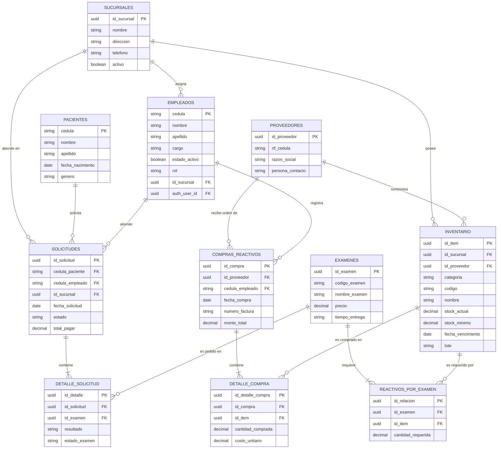

# Diagrama entidad-relación — HernandezLab

> Punto de partida: diagrama de referencia (Eraser) con `pacientes`, `solicitudes`,
> `detalle_solicitud`, `examenes`, `reactivos_por_examen`, `empleados`, `inventario_reactivos`,
> `proveedores`, `compras_reactivos`, `detalle_compra`.
>
> Cambios propuestos respecto al original (a revisar con Santander antes de darlo por definitivo):
> 1. `empleados` gana `id_sucursal` y `rol` (administrativo/recepción) — es la misma tabla que
>    respalda el login del sistema (no se crea una tabla `usuarios` aparte).
> 2. Se agrega `sucursales`, de la cual dependen `empleados`, `inventario` y `solicitudes`.
> 3. `inventario_reactivos` se generaliza a `inventario`, con una columna `categoria` (insumos,
>    reactivos, mobiliario, maquinaria) en vez de ser una tabla exclusiva de reactivos. Esto
>    también implica que `reactivos_por_examen`, `detalle_compra` y `compras_reactivos` ahora
>    referencian `inventario` en vez de `inventario_reactivos`.
> 4. `proveedores` se mantiene igual (aún por terminar de definir con el equipo).

